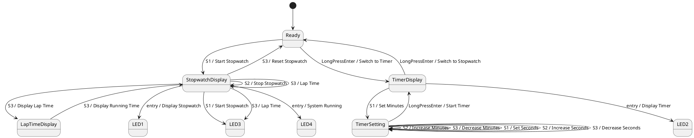
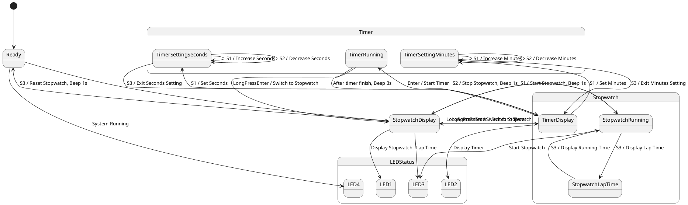

```plantuml
@startuml
[*] --> Ready
Ready --> StopwatchDisplay : S1 / Start Stopwatch
StopwatchDisplay --> StopwatchDisplay : S2 / Stop Stopwatch
StopwatchDisplay --> Ready : S3 / Reset Stopwatch
StopwatchDisplay --> StopwatchDisplay : S3 / Lap Time
StopwatchDisplay --> LapTimeDisplay : S3 / Display Lap Time
LapTimeDisplay --> StopwatchDisplay : S3 / Display Running Time

Ready --> TimerDisplay : LongPressEnter / Switch to Timer
TimerDisplay --> Ready : LongPressEnter / Switch to Stopwatch
TimerDisplay --> TimerSetting : S1 / Set Minutes
TimerSetting --> TimerSetting : S2 / Increase Minutes
TimerSetting --> TimerSetting : S3 / Decrease Minutes
TimerSetting --> TimerSetting : S1 / Set Seconds
TimerSetting --> TimerSetting : S2 / Increase Seconds
TimerSetting --> TimerSetting : S3 / Decrease Seconds
TimerSetting --> TimerDisplay : LongPressEnter / Start Timer

StopwatchDisplay --> LED1 : entry / Display Stopwatch
TimerDisplay --> LED2 : entry / Display Timer
StopwatchDisplay --> LED3 : S1 / Start Stopwatch
StopwatchDisplay --> LED3 : S3 / Lap Time
StopwatchDisplay --> LED4 : entry / System Running
@enduml
```

```plantuml
@startuml
[*] --> Ready
Ready --> StopwatchDisplay

state Stopwatch {
StopwatchDisplay --> StopwatchRunning : S1 / Start Stopwatch, Beep 1s
StopwatchRunning --> StopwatchDisplay : S2 / Stop Stopwatch, Beep 1s
StopwatchDisplay --> Ready : S3 / Reset Stopwatch, Beep 1s
StopwatchRunning --> StopwatchLapTime : S3 / Display Lap Time
StopwatchLapTime --> StopwatchRunning: S3 / Display Running Time
StopwatchDisplay --> TimerDisplay : LongPressEnter / Switch to Timer
}

state Timer {
TimerDisplay --> TimerSettingMinutes : S1 / Set Minutes
TimerSettingMinutes --> TimerSettingMinutes : S1 / Increase Minutes
TimerSettingMinutes --> TimerSettingMinutes : S2 / Decrease Minutes
TimerSettingMinutes --> TimerDisplay : S3 / Exit Minutes Setting
TimerDisplay --> TimerSettingSeconds : S1 / Set Seconds
TimerSettingSeconds --> TimerSettingSeconds : S1 / Increase Seconds
TimerSettingSeconds --> TimerSettingSeconds : S2 / Decrease Seconds
TimerSettingSeconds --> TimerDisplay : S3 / Exit Seconds Setting
TimerDisplay --> TimerRunning : Enter / Start Timer
TimerRunning --> TimerDisplay: After timer finish, Beep 3s
TimerRunning --> StopwatchDisplay: LongPressEnter / Switch to Stopwatch
TimerDisplay --> StopwatchDisplay : LongPressEnter / Switch to Stopwatch
}


state LEDStatus {
StopwatchDisplay --> LED1 : Display Stopwatch
TimerDisplay --> LED2 : Display Timer
StopwatchRunning --> LED3 : Start Stopwatch
StopwatchDisplay --> LED3 : Lap Time
Ready --> LED4 : System Running
}
@enduml
```